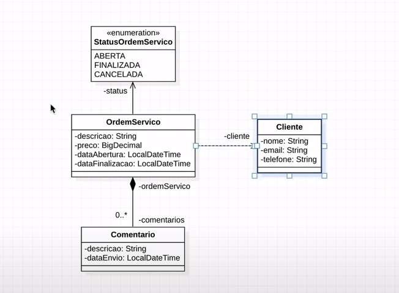
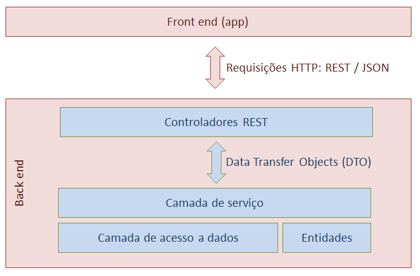

## Projeto realizado no Curso de Spring Rest da AlgaWorks, constrindo uma API Rest OsWorks com SpringBoot.

Foi desenvolvido uma api rest para Ordens de Serviços.

### Backend
* Java 1.8 ou superiror
* Gradle
* SpringBoot
    * Spring Data JPA
    * Spring Web
    * Postgres
    * H2
    * Lombok
    * ModelMapper

### Modelo conceitual

### Padrão de camadas

### Endpoints

Projeto hospedado em https://osworks-api.herokuapp.com/

* Clientes
 
  * [GET] https://osworks-api.herokuapp.com/clientes
  * [GET] https://alexsds2.herokuapp.com/clientes/2
  * [POST] https://alexsds2.herokuapp.com/clientes
  * [PUT] https://alexsds2.herokuapp.com/clientes/3
  * [DEL] https://alexsds2.herokuapp.com/clientes/1

* Ordem de serviços
 
  * [GET] https://osworks-api.herokuapp.com/ordens-servico
  * [GET] https://alexsds2.herokuapp.com/ordens-servico/2
  * [POST] https://alexsds2.herokuapp.com/ordens-servico
  * [POST] https://alexsds2.herokuapp.com/ordens-servico/1/comentarios
  * [GET] https://alexsds2.herokuapp.com/ordens-servico/1/comentarios
  * [PUT] https://alexsds2.herokuapp.com/ordens-servico/1/finalizacao